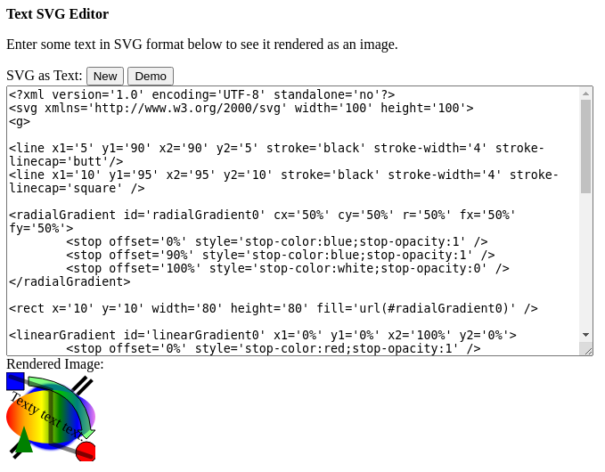

TextBasedSvgEditor
==================

A utility to edit an SVG vector graphics file by modifying its XML text
specification.

To see it in action, open Source/TextBasedSvgEditor.html in a web
browser that runs JavaScript.

Note that this utility is somewhat superfluous, insofar as you could do
much the same thing with any text editor and any web browser or other
application that can render SVGs.

 
